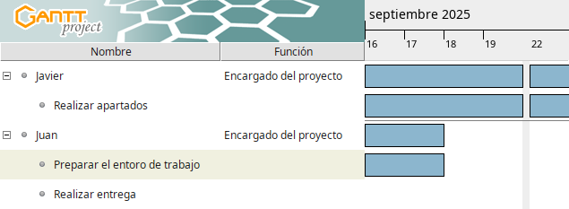

# Practica-final-Git-GitHub-VSCode-Formulari-Web
Práctica 0 - Proyecto intermodular

Cronograma GanttProject  

Roles: [Roles iniciales](docs/rols.md)

Tarea vinculada a un commit: [Preparar entorno #1](https://github.com/JavLG14/Practica-final-Git-GitHub-VSCode-Formulari-Web/issues/1)
